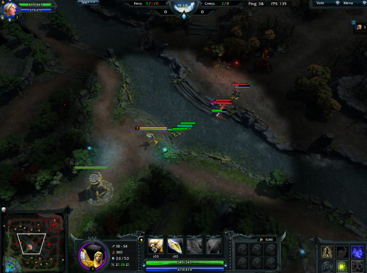

# HoN Open ACD


This is open source **UniCheat.NET** based x64 application for modify **Heroes of Newerth** gameplay.  

Current features:
 - Control player camera distance

### Download binary releases
https://github.com/V10git/HoNOpenACD/releases

Closed source, full featured version **HoN ACD** can be downloaded from official page https://v10.name/acd/

### Build
`git clone https://github.com/V10git/HoNOpenACD.git`  
`dotnet build -c Release HoNOpenACD\HoNOpenACD.csproj`

### Custom HoN scripts
For create custom script, look [example script](ExampleScript/).\
You can load custom external scripts by adding it manually to config.json  
**Example:**
```json
  "UniCheat": {
    "AllowExternalScripts": true,
    "Scripts": {
      "CameraDistance": {
        "Enable": true
      },
      "ExampleScript": {
        "Enable": true,
        "External": {
          "Filename": "ExampleScript.dll",
          "FullClassName": "ExampleScript.ExampleScript"
        }
      }
    }
  }
```

[UniCheat.Net docs](UniCheatNET/README.md)


### Contacts
ACD  Telegram: https://t.me/ACDFeedback
